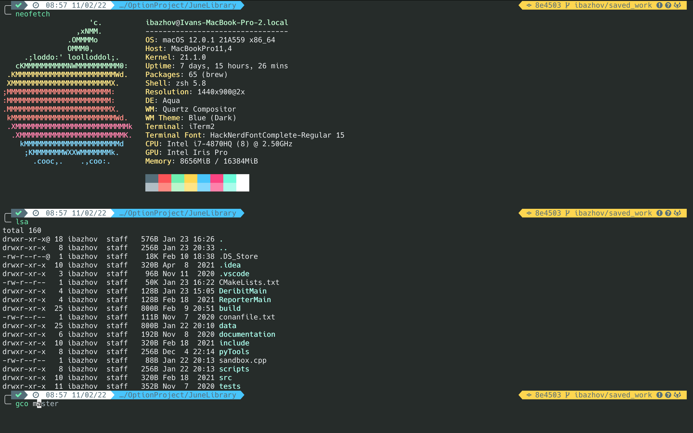

## My Terminal Setup



### Zsh and OhMyZsh

Install Zsh:
```
brew install zsh
```

Install OhMyZsh:
```
sh -c "$(curl -fsSL https://raw.github.com/ohmyzsh/ohmyzsh/master/tools/install.sh)"
```

Install highlighting: 
```
it clone https://github.com/zsh-users/zsh-syntax-highlighting.git ${ZSH_CUSTOM:-~/.oh-my-zsh/custom}/plugins/zsh-syntax-highlighting
```

Install auto-suggestion:
```
git clone https://github.com/zsh-users/zsh-autosuggestions ${ZSH_CUSTOM:-~/.oh-my-zsh/custom}/plugins/zsh-autosuggestions
```

Add plugins to the config file ```~/.zshrc```, my list of plugins:
```
plugins=(
    git
    zsh-syntax-highlighting
    zsh-autosuggestions
)
```

### Powerline-9k

Install Powerline-9k itself:
```
git clone https://github.com/bhilburn/powerlevel9k.git ~/.oh-my-zsh/custom/themes/powerlevel9k
```

Install Nerd fonts:
```
brew tap homebrew/cask-fonts
brew install --cask font-hack-nerd-font
```
Check out [Nerd fonts original page](https://github.com/ryanoasis/) and [more install options](https://github.com/ryanoasis/nerd-fonts#font-installation).

Customize your visual setup by editing ```~/.zshrc```, my setup:
```
POWERLEVEL9K_MODE="nerdfont-complete"

POWERLEVEL9K_LEFT_PROMPT_ELEMENTS=(status time dir virtualenv)
POWERLEVEL9K_RIGHT_PROMPT_ELEMENTS=(vcs)

POWERLEVEL9K_PROMPT_ON_NEWLINE=true

POWERLEVEL9K_SHORTEN_DIR_LENGTH=2
POWERLEVEL9K_TIME_FORMAT="%D{%H:%M %d/%m/%y}"
POWERLEVEL9K_TIME_BACKGROUND='white'
POWERLEVEL9K_HOME_ICON=''
POWERLEVEL9K_HOME_SUB_ICON=''
POWERLEVEL9K_FOLDER_ICON=''
POWERLEVEL9K_STATUS_VERBOSE=true
POWERLEVEL9K_STATUS_CROSS=true

POWERLEVEL9K_SHOW_CHANGESET=true
POWERLEVEL9K_CHANGESET_HASH_LENGTH=6
```

Checkout [orignal documentation](https://github.com/Powerlevel9k/powerlevel9k) and [more Powerline-9k config variants](https://github.com/Powerlevel9k/powerlevel9k/wiki/Show-Off-Your-Config).

If needed, configure VSCode terminal to Nerd fonts:
```
"terminal.integrated.fontFamily": Hack Nerd Font, Hack NF, Hack Nerd Font Mono
```

### iTerm2

On mac I use iTerm2 instead of standard Terminal:
[iTerm2 download page](https://iterm2.com])

 - [my color theme](https://lucacorbucci.medium.com/my-iterm2-setup-ed6cb1752f3b)


### Sources:
 - [on main set-up](https://medium.com/@ivanaugustobd/your-terminal-can-be-much-much-more-productive-5256424658e8)


